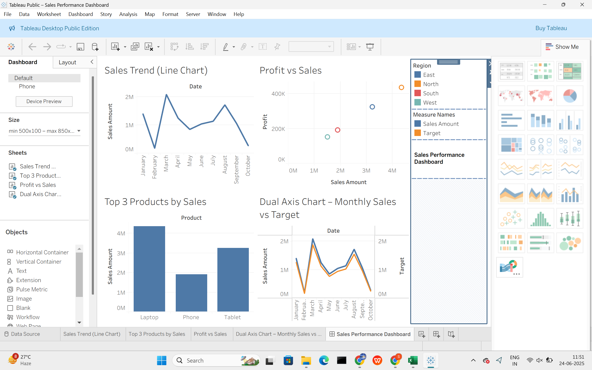
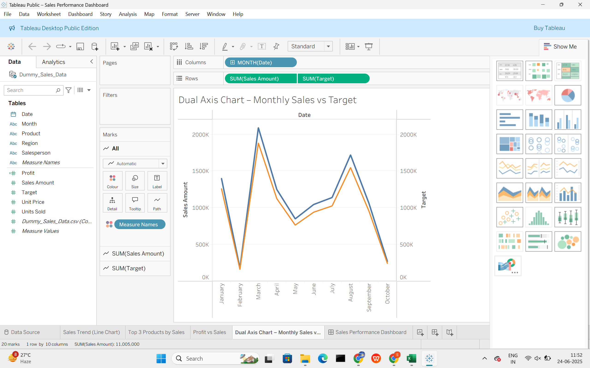
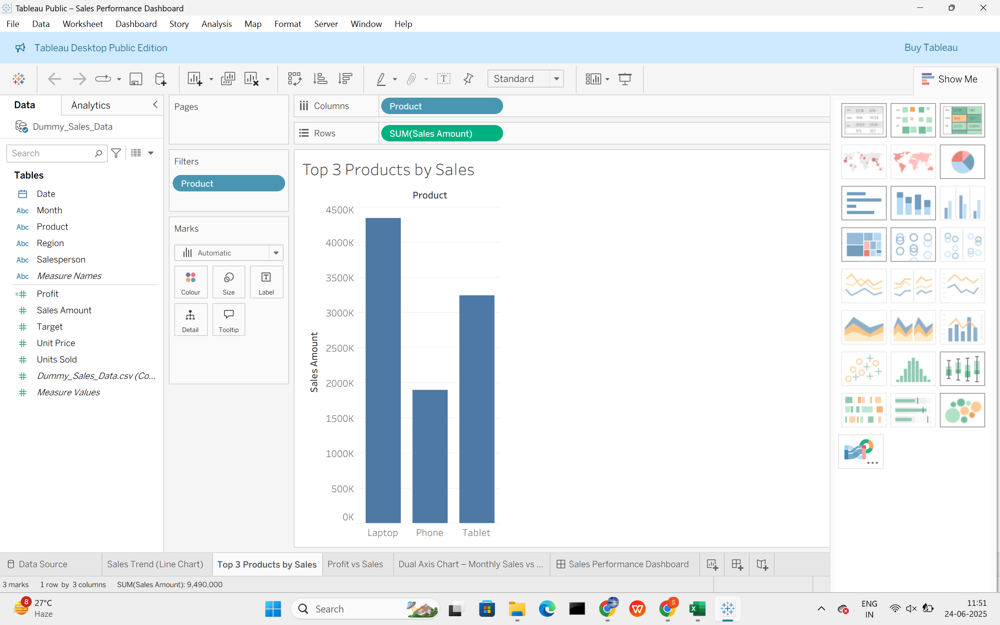
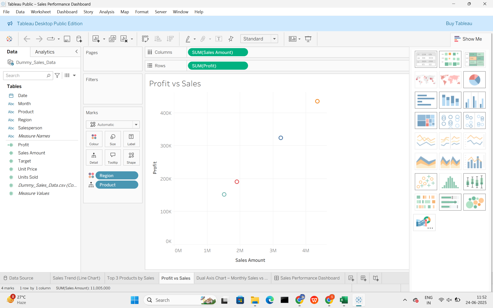
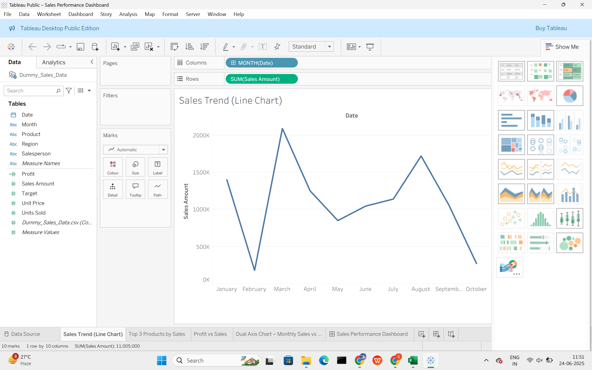

# Sales Performance Dashboard

A business-focused sales dashboard built in Tableau using dummy sales data. The project explores regional performance, product trends, and key sales metrics to help stakeholders make data-driven decisions.

---

##  Tools Used

- **Tableau** – Dashboard creation and interactive visuals  
- **Excel / CSV** – Data storage and preparation  

---

##  Key Features

- Monthly sales vs. target (dual axis chart)
- Top 3 products by sales
- Profit vs. sales comparison
- Sales trends over time
- KPI indicators: revenue, units sold, average profit

---

##  Skills Demonstrated

- Dashboard storytelling in Tableau  
- Dual-axis, line, bar, and KPI charts  
- Data cleaning and calculated fields  
- Business analysis using visual cues  

---

##  Dashboard Snapshots

### Overall View  

### Monthly Trend  

### Product & Profit Views  
  
  

---

## 🔄 Future Improvements

- Add filter controls for regions and products  
- Integrate live data from Google Sheets or APIs  
- Add dynamic year selector  

---

## 📚 References

Built as a self-practice project to enhance Tableau skills using dummy data.

---
